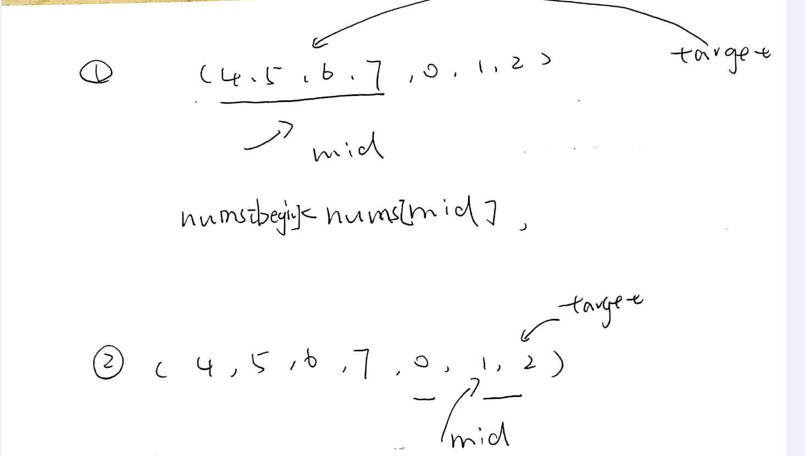

#解析
- 首先数组是有序的，要用到二分查找。关键是怎么确定mid、target、之间的位置
- 同时书写中也有一种规范
```
while(begin <= end){
  int mid = begin + (end - begin)/2;
  //查找的时候判断不判断mid 与target？
  //判断的话,值的更新就要两边同时更新
  begin = mid + 1;
  or
  end = mid + 1;
}
```
```
while(begin < end){
  //这种写法就是将不符合的规范的数字剔除
  //留下的那个就是我们要找的。
  //因此，每次只能删除一个标签
  begin = mid+ 1；
  OR
  end = mid;
}
- 边界条件的判断，什么时候取等号。尤其是判断边界的时候
```

## 总体思路


